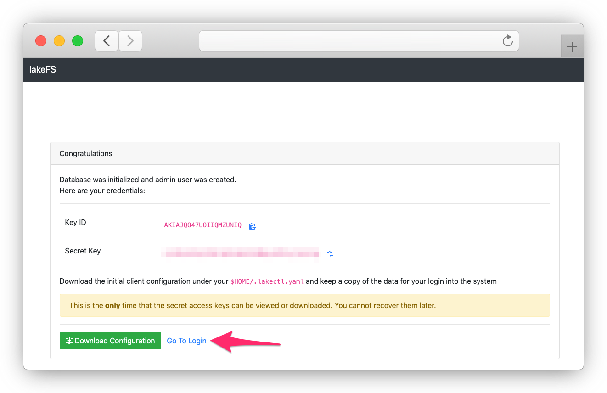
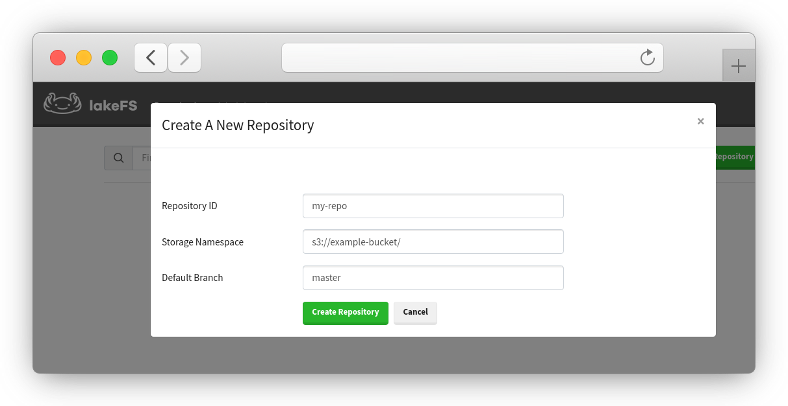

# Create a Repository

## Create a Repository

### Create the first user

Once we have lakeFS configured and running, open `https://<OPENAPI_SERVER_ENDPOINT>/setup` \(e.g. [https://lakefs.example.com](https://lakefs.example.com){: target="\_blank" }\).

Note: If you already have lakeFS credentials, skip to step 2 and login. {: .note .pb-3 }

1. Follow the steps to create an initial administrator user. Save the credentials you've received somewhere safe, you won't be able to see them again!

   

2. Follow the link and go to the login screen

   

3. Use the credentials from step \#1 to login as an administrator

### Create the repository

1. Click `Create Repository`

   

   Under `Storage Namespace`, be sure to set the path to the bucket you've configured in a [previous step](index/).

## Next steps

After creating a repo, you can import your existing data into it. lakeFS offers an [Import API](import.md) to bring your data without copying it. Alternatively, if you wish to copy existing data from an S3 bucket to lakeFS, use [DistCp](https://github.com/treeverse/lakeFS/tree/edb733eaf01e4b78c3896e621a40cc0756aa3e41/docs/integrations/distcp.md) or [Rclone](https://github.com/treeverse/lakeFS/tree/edb733eaf01e4b78c3896e621a40cc0756aa3e41/docs/integrations/rclone.md).

Check out the usage guides under [Integrations](../index-6.md) for other options.

